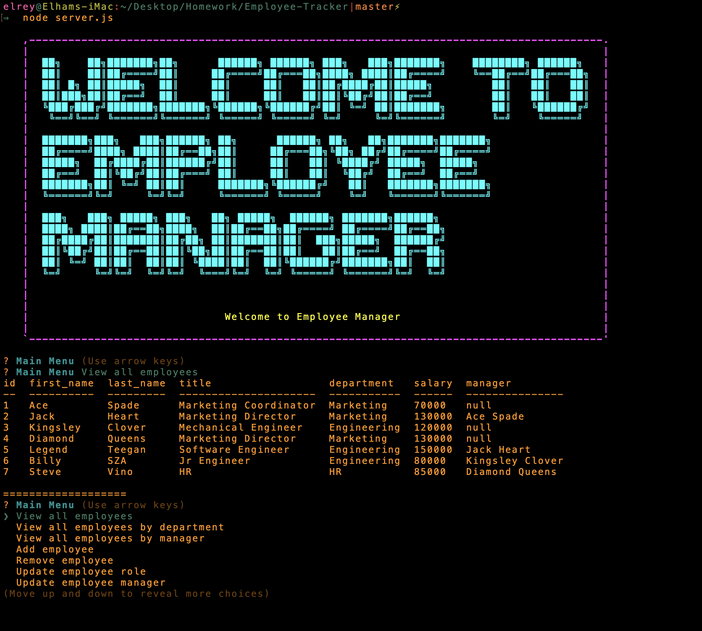

# ReadMe Generator
 ## Image
 

  

  Contents of This File
  * [Description](#description)
  * [Technologies](#technologies)
  * [Installation](#installation)
  * [Contributors](#contributors)
  * [Tests](#tests)
  * [Questions](#questions)
  * [License](#license)

  # Description 
  The Employee Tracker application is a Node.js command line based employee management system to add and manage employees, managers, roles and departments. 

  ### Technologies:

  Node.js
 ---

  ### Installation:

  install dependecies:
  * npm i 
  * npm install inquirer
  * npm asciiart logo
  * npm

  #### Usage :

  * run program on command line "node server.js"

    User will be brought to the main menu to navigate using arrow keys to execute commands.

 #### License:
  
  ---

  #### Tests:
  NaN

  ### Contributors:
  Elham T.Hussain :https://github.com/ElhamFabe/ReadMe_Generator

  #### Questions:
  Elhamfabe@gmail.com
 ---

  
